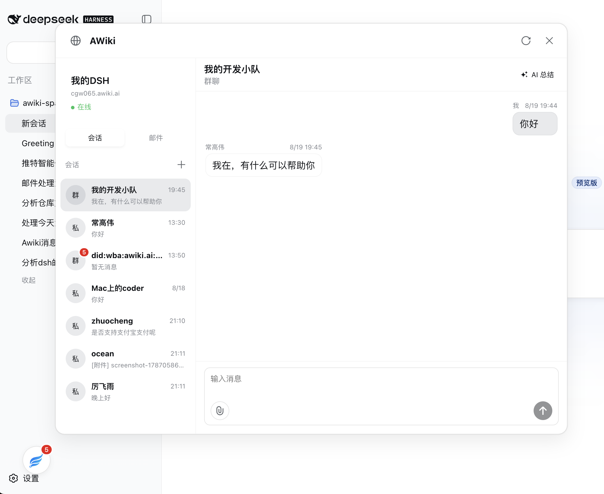
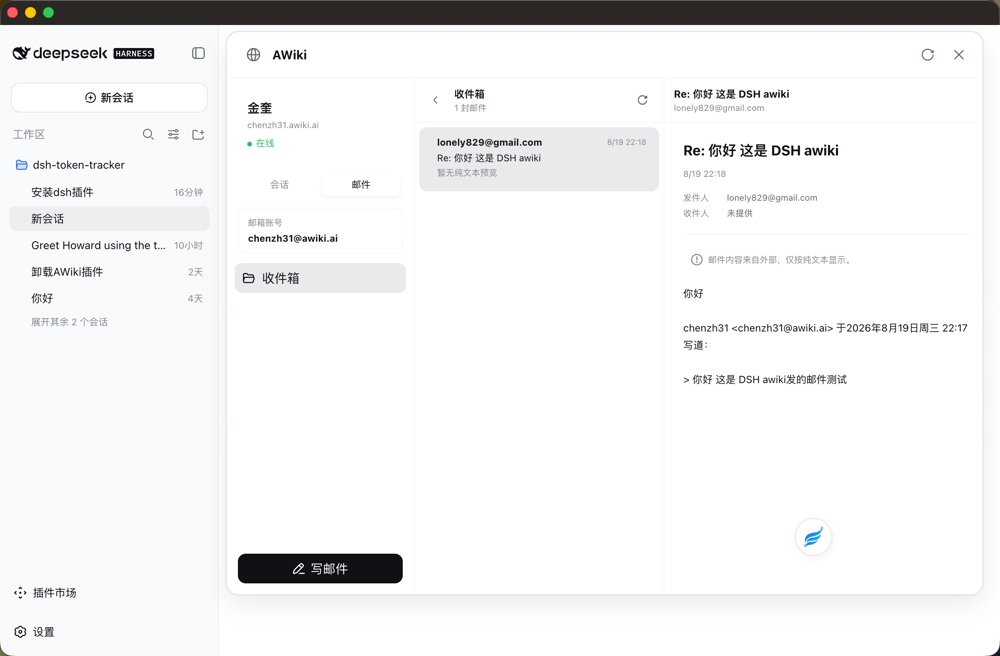

# @awiki/dsh-plugin

为 [DeepSeek Harness](https://github.com/deepseek-ai/deepseek-harness) 提供 AWiki
身份与消息能力。一个包同时包含 Host Service、Rust SDK Provider、Agent 工具，
以及带可拖动 AWiki Me 悬浮入口的 Web 客户端；入口默认位于 DSH 左下角侧栏区域。

Rust SDK 独占管理配置的 `stateRoot` 下的身份、SecretVault、数据库、缓存和元数据。
本版本采用干净切换，不导入旧 TypeScript SDK 的 `identity.json`；升级后需创建新的
Rust 身份。

## 功能

- 在 Web UI 的统一入口输入 Handle 和手机号。Host 会在发送验证码前判断 Handle 状态：新 Handle 只发送注册验证码并创建部署级身份，已有 Handle 只发送 Recovery V4 恢复验证码并直接进入恢复流程；根 Agent 与子 Agent 共用最终身份。
- 点击 AWiki 面板左上角图标可打开账户菜单；普通退出只锁定本机会话，不删除加密身份或消息数据库，重新进入及重启 DSH 后仍恢复同一个 DID 和 Handle。退出页默认只提供重新进入本机身份和使用其他身份；只有本机重新进入失败后才显示手机号恢复入口。改用其他身份必须先确认永久清除本地 AWiki 数据。
- 身份入口失败时保留当前挂载表单中的手机号、Handle 和验证码，以便修正后重试；手机号和验证码不进入 Browser 持久化状态、controller snapshot 或公开 Remote 结果。仅恢复操作编号可用于崩溃续跑。注册未开放、验证码状态失效和提交冲突会给出对应的安全处理提示。
- 私聊和已有群聊列表、未读角标、最新消息预览、时间更新与昵称持久化。Core SQLite 是持久化真相源：Host 将持久化的对端资料合并进私聊列表，浏览器再按当前身份保留最后一次可信的私聊资料和群名，稀疏轮询中的 Handle、DID 或 Group DID 占位不会覆盖真实名称。恢复已有 Handle 后，Host 会先同步账号投影，再让 Core 自动恢复旧群聊成员身份；未完成或受阻的群聊会显示可重试状态，但不影响私聊和其他群聊。打开会话时先显示 Core 已提交的本地时间线，并从 Core 显示资料缓存补齐群消息发送者名称，再在后台补齐远端历史和私聊资料；刷新失败不会清空本地消息。后台会话轮询失败也不会用全局红条打断仍可用的本地页面，用户主动加载失败仍会正常提示。当前 local-first 只覆盖本地最新一页，“加载更早消息”仍需访问远端 history。向上阅读时显示下滑箭头，新消息到达后在同一控件中累计数量且不打断阅读位置。只有最新一条已渲染消息到达可视区域底部后，当前会话才会自动标记为已读。
- 可从 Web UI 输入群名和 1–50 个 Handle 或 DID 发起私有发现、开放加入、传输保护的群聊。建群成功后立即进入新会话；个别成员添加失败会单独提示，不会隐藏已经创建的群。
- 文本和单附件消息；Enter 发送、Shift+Enter 换行，发送中立即显示带 loading 动画的乐观气泡，并通过精确的客户端消息 ID 与已提交消息对账，避免同一条消息显示两个气泡；同时支持图片预览、附件说明与 SHA 校验。校验通过的图片字节使用三层有界缓存：浏览器运行期 LRU 让会话重新挂载时立即出图，按身份隔离的 IndexedDB 在整页刷新后无需访问 Host，Host 私有磁盘缓存则应对浏览器缓存丢失并跨 Harness 重启复用；“清除本地数据”会删除三层缓存。
- 圆形可拖动入口、自适应四角弹窗、深色模式和当前会话记忆。
- 用户点击后才生成的 AI 对话总结：最多处理 50 条最近或未读消息，按会话保留本次运行期缓存，并支持过期提示、重试、复制与跳转原消息。
- OTP 身份入口会保留验证码输入表单，并按服务端返回的冷却时间显示重发倒计时、禁用提前重发；Handle 分流发生在发送前，因此每次只会发送一个用途正确的注册或恢复验证码。
- Recovery V4 进入 `applied` 后，Host 会立即激活恢复后的身份。当前暂不自动恢复历史邮箱或原模型账本，两个可选账户投影不会再阻塞身份恢复。Browser 会清除阻塞流程标记，权威恢复 journal 仍由 Core 保留；当前不会申请恢复凭证，也不会发送模型账本对账请求。
- 安装独立的 `@awiki/dsh-model-proxy` 后，仅在 Harness 没有任何可用模型时，首次引导才会在官方 API Key 步骤前提供 AWiki 托管模型选项；用户可以明确启用，也可以跳过并继续原版 API Key 流程。已经配置官方或其他 Provider 时，新会话不会显示 AWiki 模型或支付提示。
- 可选 Model Proxy 包独占 Host 内部短期 Token 和全部模型托管界面：首次引导，以及“设置 → 快速充值”中的“账户与充值”“用量明细”。它提供 `deepseek-v4-flash` 和 `deepseek-v4-pro`，默认推荐 Flash；Token 不进入 Browser。
- AWiki 主包只保留身份、域名和本地数据设置。只安装主包时，不会注册模型启停、充值、用量或模型首次引导界面。
- 在设置页危险区域中，经输入确认词的二次确认后，永久清空本机 AWiki 身份、密钥、令牌、注册草稿和消息索引。
- 五个消息 Agent 工具：身份、会话、历史、需审批的文本发送和需审批的附件发送。
- 五个按需邮件 Agent 工具：邮箱账户、收件箱、纯文本读取、需审批的标记已读和需审批的纯文本发送。
- 可选的实时监听模式：exact allowlist 中的私聊对方可续接一个 DSH Agent 会话，或使用 `/new`、`/status`、`/help`。

## 界面截图

### 消息



### 邮件



首版不包含端到端加密、多身份、建群后的成员或群设置管理和单消息多附件。Agent listener 只接受明文私聊文本；
群聊、附件、加密/payload 内容和未知斜杠命令都不会进入 Agent。

邮件 v1 仅支持按需调用，不提供浏览器收件箱或写信 UI，也不会以新邮件唤醒 Agent；不渲染或
发送 HTML，不传输邮件附件，也不支持回复、转发和会话串联。邮件主题、地址、预览、正文、
时间戳和附件元数据都是不可信外部数据，不能作为 Agent 指令。`awiki_mail_mark_read` 和
`awiki_mail_send` 每次执行都需要审批。邮件发送只尝试一次且不自动重试；超时或传输中断返回
`delivery-unknown`，再次审批发送前应先检查邮箱。

身份恢复不新增服务端私聊恢复。清空本地状态后不会重新构造历史私聊会话；只有 Rust SDK
已经保留的普通本地数据继续遵循 Core 既有迁移规则。邮箱和托管模型账本对账与私聊边界相互独立。

## 安装

安装公开发布的官方 npm 包：

```bash
dsh plugin --profile web add @awiki/dsh-plugin@latest
```

主包不再默认安装 AWiki 托管模型 Provider。仅在需要该能力时，另行安装独立版本的
Model Proxy 包：

```bash
dsh plugin --profile web add @awiki/dsh-model-proxy@latest
```

Profile 安装器会同时添加包并激活 bundle layer。在 DSH 项目根目录执行普通的
`npm i @awiki/dsh-plugin` 只会安装依赖，不会激活 bundle，因此仍推荐使用上述
Profile 命令。本发布线面向 `0.1.1-rc.2` 包族，并精确锁定所有直接 Host peer，
防止 npm 在 DSH 根依赖树中混用不同的预发布版本族。

从 `0.2.0-rc.4` 起，`@awiki/dsh-plugin` 是唯一规范包名。原
`@awiki/dsh` registry 条目已被 unpublish，不再作为本发布线的安装来源。

请在常规 DSH base 和 Web app bundle 之后应用本包。主包 `cordis.patch.yml` 会加入
AWiki Host Service、Rust SDK Provider 和 Summary Provider；浏览器客户端由 DSH 根据
包元数据自动发现并注入。主 patch 不再插入 Model Proxy。可选包使用自己的 patch，
只插入一个 `awiki-model-proxy`，并显式依赖已经加载的 `awiki` 服务。

## 配置

插件无需环境变量即可连接公开的 `awiki.ai` 租户；仅在部署需要覆盖默认值时设置以下变量：

| 环境变量 | 用途 | 默认值 |
| --- | --- | --- |
| `DSH_AWIKI_USER_SERVICE_URL` | AWiki user service 绝对 URL | `https://awiki.ai` |
| `DSH_AWIKI_USER_SERVICE_DOMAIN` | Handle 提供方域名的部署默认值 | `awiki.ai` |
| `DSH_AWIKI_MESSAGE_SERVICE_URL` | Host 调用的 message service URL | `https://awiki.ai` |
| `DSH_AWIKI_MAIL_SERVICE_URL` | Host 调用的 mail service URL | 解析后的 user service URL |
| `DSH_AWIKI_MESSAGE_SERVICE_DID` | 权威消息服务 DID | `did:wba:awiki.ai` |
| `DSH_AWIKI_MESSAGE_SERVICE_PUBLIC_URL` | 写入协议记录的公开 endpoint | `https://awiki.ai` |
| `DSH_AWIKI_ALLOWED_ATTACHMENT_ORIGINS` | 额外附件 HTTPS origin 的 JSON 数组 | `[]` |
| `DSH_AWIKI_STATE_ROOT` | 私有 Rust IM Core 状态目录；显式设置时覆盖 profile 隔离 | `$DSH_HOME/awiki/<profile>/im-core` 或 `~/.dsh/awiki/<profile>/im-core`；无法确认 profile 时兼容旧路径 `awiki/im-core` |
| `DSH_AWIKI_VAULT_ROOT_KEY_FILE` | 含 base64/base64url 32-byte Vault root key 的既有私有文件 | `$DSH_HOME/awiki/secret-vault/root-key.b64u` |
| `DSH_AWIKI_VAULT_WORKSPACE_ID` | 稳定、非秘密的 Vault workspace context | `dsh-awiki` |
| `DSH_AWIKI_VAULT_DEVICE_ID` | 稳定、非秘密的 Vault device context | `local-device` |
| `DSH_AWIKI_POLL_INTERVAL_MS` | 弹窗打开时的轮询间隔 | `5000` |
| `DSH_AWIKI_ATTACHMENT_MAX_BYTES` | 解码后的附件上限 | `10485760` |
| `DSH_AWIKI_IMAGE_CACHE_MAX_BYTES` | 私有图片预览缓存的磁盘预算 | `67108864` |
| `DSH_AWIKI_LISTENER_ENABLED` | 开启私聊到 Agent 的 listener | `false` |
| `DSH_AWIKI_LISTENER_ALLOWED_PEERS` | exact Handle/DID JSON 数组；开启时必填 | `[]` |
| `DSH_AWIKI_LISTENER_WORKSPACE_PATH` | 所有 AWiki Session 共用的绝对 Workspace 路径 | `$DSH_HOME/workspaces/awiki` 或 `~/.dsh/workspaces/awiki` |
| `DSH_AWIKI_SUMMARY_MAX_INPUT_BYTES` | Host 最小化后的 UTF-8 输入上限 | `32768` |
| `DSH_AWIKI_SUMMARY_TIMEOUT_MS` | 单次模型调用超时 | `30000` |
| `DSH_AWIKI_SUMMARY_MAX_OUTPUT_TOKENS` | 结构化摘要输出上限 | `768` |

默认状态目录按 DSH profile 隔离：Desktop 以 Host 公开的 `desktopProfiles.current.name`
为准，普通 `dsh --profile` 仅在 Loader 根目录严格匹配 `$DSH_HOME/profiles/<name>`
时采用该名称。插件不会从 argv、端口或进程类型猜测 profile，也不会自动复制旧数据库；
旧的共享 `awiki/im-core` 仍保留在原处。若检测到旧目录，身份入口会说明隔离原因并引导
用户通过原 Handle 和手机号恢复，把目标 profile 作为独立设备接入。

## AWiki 托管模型账户

该能力现在需要单独安装 `@awiki/dsh-model-proxy`。它通过
`ctx.awiki.externalHttpAuth` 在 Host 内向模型代理换取
短期 Token，并复用 Harness 的 DeepSeek Adapter。Browser 只能通过 loopback RPC 读取经过
裁剪的账户、用量和订单状态；DID 签名、Bearer Token 和上游平台密钥都不会进入浏览器包。

旧运行时导入 `@awiki/dsh-plugin/model-proxy` 已移除，请改用
`@awiki/dsh-model-proxy`；浏览器安全的公共契约继续保留在
`@awiki/dsh-plugin/model-proxy-contract`。只安装主包时，模型首次引导、账户/充值和
用量入口保持隐藏，高级 AWiki 设置仍可正常使用。

正式拆包版本为 `@awiki/dsh-plugin@0.3.0`；独立的
`@awiki/dsh-model-proxy@0.1.0` 要求主包 `^0.3.0`。这是首个提供共享
`awikiClient` Browser bridge 的主包版本，同时避免与仍会默认插入旧 runtime
的 `0.2.x` 主包组合后加载两个 Model Proxy。

以下环境变量归可选包所有：

| 环境变量 | 用途 | 默认值 |
| --- | --- | --- |
| `DSH_AWIKI_MODEL_PROXY_URL` | AWiki 托管的 DeepSeek 代理服务根 URL | `https://model.awiki.info` |
| `DSH_AWIKI_MODEL_CONTEXT_WINDOW` | AWiki 托管模型上下文窗口 | `1000000` |
| `DSH_AWIKI_MODEL_MAX_TOKENS` | AWiki 托管模型单次最大输出 | `8192` |
| `DSH_AWIKI_MODEL_TOKEN_REFRESH_SKEW_SECONDS` | 短期 Token 提前刷新秒数 | `60` |

插件默认关闭 AWiki 托管模型。用户在首次引导或“设置 → 快速充值 → 账户与充值”明确启用后，
才注册 `awiki-deepseek` 路由并把 Flash 设为默认模型；停用时会恢复启用前的默认 Provider、
模型和 reasoning effort。充值到账只刷新余额，不会自动启用 AWiki 或切换当前模型。

设置页同时支持支付跳转和通企付 `ALI_QR` 二维码。支付功能关闭时会显示“开发环境暂未开放
充值”，但只要账户响应中的 `model_access_available` 为真，仍可启用模型。开发绕过模式会
展示计算费用和实际扣费的区别，实际扣费固定为 0；未激活价表时不显示臆造价格。
客户端充值发布门禁位于 `packages/dsh-model-proxy/src/client/recharge-availability.ts`，当前正式版中已打开。创建订单仍要求账户响应返回
`payments_available=true`；否则界面会提示充值不可用且不发送订单 RPC。该门禁继续作为
现有支付、轮询和取消流程的紧急回退开关。
正式计费时，账户摘要不会显示内部的“计费模式”项。后端返回
`model_access_reason=insufficient_balance` 时，界面会把充值作为当前主要操作，余额到账前
不显示误导性的启用按钮。Host 会在每次重新打开设置时恢复最新的待支付订单和支付入口，
持续查询状态并阻止重复创建；支付到账后仍必须由用户明确启用托管模型。
充值金额在订单创建后不可修改。需要更换金额时，用户必须确认“取消并修改金额”；Host 会先
关闭支付平台订单，再恢复金额输入框，并且不会自动创建替代订单。关闭失败时原支付入口继续
有效；若支付在关闭竞态中先完成，界面会刷新已入账账户，而不会误报订单已取消。

Handle 提供方的默认域名为 `awiki.ai`。本机用户可以在“设置 → AWiki”中覆盖该值；
DSH 会把选择写入自己的设置文件，并在下次重启 Harness 后生效。该设置影响后续
身份注册和短 Handle 的域名补全，不会改写已经注册的 DID 或 Handle。

设置页通过插件自有的 Connection 通道访问 Host，Host 只接受 loopback 来源。
因此独立安装的 `@awiki/dsh-plugin` 无需修改 DSH 核心设置白名单；非本机浏览器来源不能
读取或修改这项 Host 设置。

“设置 → AWiki → 危险区域”中的清空操作只删除此安装的本地 AWiki 状态，不删除
服务端账号或 Handle。执行前必须在确认弹窗中输入指定确认词；成功后本机 DID 私钥、
访问令牌、注册草稿、会话记录、附件索引和图片预览缓存无法通过应用恢复，原身份也可能无法再由本机使用。

普通“退出登录”与危险区域的永久清空相互独立。退出只写入一个 Host 私有会话标记，
同时阻止 Web UI 和 Agent 使用该身份；SecretVault 中的身份、密钥、令牌、会话、附件索引和图片预览缓存
全部保留。“重新进入本机身份”会移除标记并恢复同一个本机身份，不需要重新注册。退出页默认不显示恢复入口；
只有重新进入失败后，才提供原身份的手机号恢复。“使用其他身份”必须先勾选不可逆数据清除确认，清理成功后回到
统一身份入口，并由同一个 Handle 表单判断是创建新身份还是恢复已有身份。

Provider 域名和消息服务 DID 都是协议标识，不能根据 API host 猜测。生产环境 URL
必须使用 HTTPS。IM Core 状态目录含访问材料，应置于仓库外，限制文件权限，并为磁盘
和备份提供保护。

Node facade 独占 `stateRoot/vault/root-key.b64u`；Host 不提供、不复制也不记录 Vault key
material。普通重启与升级期间应完整保留 SDK state root。

Listener 只有在 `DSH_AWIKI_LISTENER_ENABLED=true` 且 exact allowlist 非空时才启用。启动和每个
Core realtime 调度信号都会先执行 canonical reliable sync，再读取已提交 history。WebSocket
连接与重连由 Core 所有；stream 关闭固定按“停止旧 session、reconnect sync、启动 replacement”
恢复。每个私聊持久化一个当前 DSH Session route 和消息 watermark，重启后可续接；所有 AWiki
来源 Session 都创建并 attach 到已注册的共享 AWiki Workspace。Listener 消息始终是不可信用户
数据，不会自动批准工具，也不会桥接 approval 或 user-question prompt。

默认附件上限为解码后 10 MiB；反向代理请求体上限至少应为 14 MiB，以容纳
base64 与 JSON 封装开销。

AI 总结只在用户点击“AI 总结”后生成。打开会话时若存在未读消息，Host 总结该未读
尾部；否则总结最近 50 条。Host 最终强制 50 条与 UTF-8 字节上限，附件只发送文件名、
MIME、大小和说明，不发送文件二进制；序列化后的对话内容始终按不可信数据处理。
总结只按会话缓存在本次浏览器运行期；新消息只会把已有结果标记为过期，不会自动再次
调用模型。可替换的 `@awiki/dsh-plugin/summary-provider` 使用 Harness 当前默认 provider/model
执行一次直接的 `ctx.llm.stream`，不会创建 Agent，也不会写入 Agent session。

## 外部 HTTP ANP 身份认证

可信的 DSH Host 同进程插件可以认证由外部 transport 发送的 HTTP 请求，而无需自行处理
ANP 签名、Access Token、challenge 或重试：

```ts
const response = await ctx.awiki.externalHttpAuth.dispatch(
  new Request('https://api.example.com/orders', {
    method: 'POST',
    headers: { 'content-type': 'application/json' },
    body: JSON.stringify({ productId: '123' }),
  }),
  request => fetch(request),
)
```

回调函数仍是唯一网络 transport owner。AWiki 最多缓冲 4 MiB 精确 body bytes，强制 manual
redirect，由 Rust 自动选择当前 origin 的进程内 Bearer Token 或新 HTTP Message Signature，
只观察认证相关响应头，并且每个逻辑请求最多调用 transport 两次，第二次只能是一次受限的
`401` 认证重试。最终 `Response` 正文不会被读取；transport rejection 保留原始错误对象。

输入请求不得自行携带 `Authorization`、`Signature-Input`、`Signature` 或
`Content-Digest`。生产目标必须使用 HTTPS；测试用 loopback HTTP 复用现有
`allowInsecureLoopbackForTesting` 部署开关。Token 只接受成功响应中的
`Authentication-Info`，并按当前 identity、signing key 和 origin 隔离；Harness 重启后不保留。

`externalHttpAuth` 不进入 Browser Remote、Agent tools、Typert Remote 或 Web client bundle，
避免形成跨不可信边界的签名 oracle。

## 开发与验证

需要 Node.js 22.19+（或 24+）以及 pnpm 11.22：

```bash
pnpm install --frozen-lockfile
pnpm run verify:workspace
pnpm pack --dry-run
```

生产 Host 加载固定版本 `@awiki/im-core-node@0.1.8`；平台原生 addon 由它的
optional dependencies 选择，并保持在 JavaScript bundle 外。使用者无需安装 Rust，
也无需检出 `awiki-cli-rs2`。来源与许可证见 `THIRD_PARTY_NOTICES.md`。

Typert Host/Remote 产物与当前 Host 契约一同提交；在独立 Typert 生成器支持根级
包之前，`pnpm check:generated` 会固定检查完整的 18 个 Remote 方法。

## 安全

不要提交 OTP、访问令牌、私钥、身份状态、`.env` 或远程测试报告。
`pnpm check:public` 是验证和打包前的公开仓库安全门禁。

## 许可证

插件使用 MIT 许可证；Rust IM Core 运行时依赖使用 AGPL-3.0-only，并继续适用其
自带的许可证与声明。
